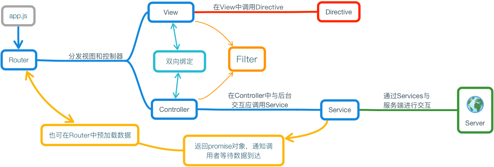

# 简介

  　　本模版是基于Angular和Ace Admin的后台管理模版。使用Angular提供页面渲染、路由管理、页面分发等业务逻辑的管理，使用Ace Admin提供样式的支持。内部提供了一些常用的指令和方法，如模态框、树形选择框，树形复选框、开关按钮、翻页控件等。今后会陆续加入新的指令，总结成前端库，方便今后的快速开发和使用。

# 为什么使用Angular?

  Angular是一个由Google发起的开源项目，基于**MVVM**设计模式的前端框架，相比传统的Web App来说，它有以下几点好处。

  1. MVC
  1. 模块化
  1. 双向数据绑定
  1. 指令系统，可以对模版进行复用
  1. 依赖注入

  　　Angular提供了路由拦截机制，可以在前端进行视图的分发，减轻服务端压力。并且提供了Controller，每个Controller都有自己独立的作用域，而不是绑定在全局对象`window`上，这样可以避免污染全局空间。

  　　模块化的好处也是不言而喻的，首先从开发上来说，可以将页面拆分成若干个模块，常用的模块可以封装为指令进行重复调用，而这是传统的Web App无法提供的。再从维护上来说，模块化更利于维护，在项目出现Bug或需求发生变更时，前端代码往往需要作出变更，而以往使用如**easy-ui**或**jQuery**开发时，每个页面中的所有js代码往往都写在了一起，十分不利于维护。而Angular可以用组件或模块化开发的模式，每个小的模块只专注于自己的业务逻辑，每个模块有属于自己的作用域，不会造成命名冲突，也会使业务逻辑更加清晰、有条理。

  　　双向数据绑定是Angular的重中之重，在以往的开发中，我们需要手动的去维护视图和变量，而在Angular中，无论我们修改视图还是变量，只要其中一个发生变化，另一个也会随之改变，这些都是Angular帮我们所做的工作。假设我们有一下表单，用于提交用户名和密码：

  Html

  ```html
  <form>
      <input type="text" name="username" id="username"/>
      <input type="password" name="password" id="password">
  </form>
  ```

  通常情况下我们需要这样获取到表单的值：

  Javascript

  ```javascript
  var user = {
      username: $('#username').val(),
      password: $('#password').val()
  }
  ```

  而在Angular中，我们只需将user对象绑定到表单上即可：

  Html:

  ```html
  <form>
      <input type="text" name="username" ng-model="user.username"/>
      <input type="password" name="password" ng-model="user.password">
  </form>
  ```

  Javascript:

  ```javascript
  $scope.user = {
      username: '',
      password: ''
  }
  ```

  　　就是这样，只需要在`$scope`对象上创建一个user对象，然后将这个user对象绑定到表单中即可，我们无需在进行任何操作。当我们对表单进行修改时，user对象的值会自动发生改变；当user对象发生变化时，页面表单中的值也会相应的发生改变。

  　　Angular采用了依赖注入的形式，将所需的模块注入到相应的模块中，这种模式可以是结构变得更清晰。假设我们有一个`UserService`用来同服务端获取数据，那么在`UserController`中，我们就可以将`UserService`注入进来：

  ```javascript
  angular.module('angularAceAdminApp')
      .controller('UserController', [
        '$scope',
        'UserService',
        function ($scope, UserService) {
          // TODO: do some thing...
        }
      ]
    );

  ```

# 不适用Angular的情况

  　　以上说了Angular的种种优点，那么在所有的地方都可以使用Angular吗？当然不是的，Angular更适用与CRUD的应用，市面上90%的应用都是CRUD应用，但仍有一些情景不适合使用Angular：

  1. Angular不适合进行游戏的开发，因为操作Dom元素是一件极其浪费性能的事情，所以当需要进行游戏开发时，并不推荐使用Angular。可以考虑**canvas**或**Unity 3D**等进行游戏的开发。

  2. 图形界面编辑器，同样是出于性能的原因，对于复杂页面和频繁操作Dom的应用不适合使用Angular

  3. 兼容低版本浏览器。当我们需要兼容例如**IE8**甚至更之前的版本时，不适合使用Angular。由于Angular使用了一些新的特性，老版本的浏览器并不支持这些特性（将Angular 的版本降级到1.2是可以在IE8浏览器上运行的），当需要兼容这些低版本浏览器时，更推荐使用一些兼容性比较好的库，例如： **easy-ui**。

  　　在公交运营管理系统的开发中，也发现了Angular 1.x版本的一些不足之处，自定义指令在`ng-repeat`中无法正确的双向绑定，在对搜索框进repeat操作时，Angular无法正确的双向绑定，当自定义指令中的值发生改变时，Angular会将其清空。在项目中暂时由其他方法替代。还有Angular虽然支持模块化，但支持的并不理想，在管理大型的项目中，控制器和视图的零散化依然会造成一些不便。类似于**Vue.js**这样的集中管理方案在实际开发中显得更为妥当。后续计划将此模版迁移至**Vue.js**。


# 目录结构

  - app
    - images
    - scripts
      - controllers
      - directives
      - services
      - filters
      - app.js
    - styles
    - template
    - views
    - index.html
  - docs
  - lib
  - bower.json
  - gulpfile.js
  - package.json

1. app

  　　app文件夹用于存放项目的源代码，包括图片、控制器、指令、服务、过滤器、程序的入口文件`app.js`、样式表、模版、页面和启动页面`index.html`，下面对各个文件夹进行说明：

  - images

    用于存放各种静态的图片文件，比如项目的图标等不需要经常变动的图片文件。

  - script

    存放前端全部的源码，包括`controller`、`directive`、`service`、`filter`和`app.js`。

    `controllers`为每个页面的控制器，页面中全部的逻辑代码应该写在此处。

    `directives`为Angular应用的指令，本后台模版中提供的模态框、树形选择框，树形复选框等指令就存放于`directives/frame`下。指令的模版应存放于`app/template`中。

    `filters`中存放的是Angular的过滤器，通常用于格式化数据，比如后台发送来的数据中，时间是一个字符串，而我们更期望它是一个`Date`对象。那么这时候使用`filter`就是一个很好的选择。

    filter:

    ```javascript
    angular.module('angularAceAdminApp')
        .filter('SampleFilter', [
              function () {

                  var SerializationDate = function (input) {
                      return new Date(input);
                  }

                  return {
                      SerializationDate: SerializationDate
                  }

              }
           ]
        );
    ```

    controller:

    ```javascript
    angular.module('angularAceAdminApp')
        .controller('SampleController', [
              '$scope',
              '$filter',
              function ($scope, $filter) {

                  // TODO: do some thing

                  $scope.date = $filter(SampleFilter).SerializationDate('2016-11-02');

                  ...
              }
           ]
        );
    ```

    `services`用于存放Angular应用的服务，服务一般是于服务端交互的部分，或整个angular应用的通用方法。本模版的`CommonService`就存放于`services`文件夹下。关于更多`service`的介绍请查阅[模版组成](#)。

    `app.js`文件是整个Angular应用的入口文件，在该文件内定义了所要拦截的路由，并为相应的页面分发view和controller。

  - styles

    存放样式表文件，可使用`Less`等语言，之后使用`Gulp`进行编译。

  - template

    存放指令的模版文件。

  - views

    存放每个路由所对应的页面，在运行过程中由路由进行view和controller的分发。

  - index.html

    该文件是整个Angular应用的启动页面，在该页面中引用全部的资源文件。

1. docs

  本模版的文档文件，采用markdown编写。

1. lib

  存放外部的资源文件，Ace Admin的资源文件就存放于此。

1. bower.json

  本模版使用bower管理资源文件的依赖，使用如下命令安装bower

  ```javascript
  npm install bower -g
  ```

  本模版的根目录，使用bower安装依赖：

  ```javascript
  bower install
  ```

1. gulpfile.js

  项目构建的相关命令，本模版默认使用Gulp作为构建工具，你也可以使用其他的构建工具，如Grunt和Webpack。

1. package.json

  项目构建所需要的依赖，进入本模版的根目录，使用如下命令进行安装。

  ```javascript
  npm install
  ```


# 模版组成

  　　模版整体大致由视图(view)、控制器(controller)、模版(template)、指令(directive)和服务(service)5个部分组成。整体流程如下：

  

## 路由（route）

  1. 路由管理使用 `ui.route` 进行管理，所有的路由全部在`app.js`中定义（app/scripts/app.js，app.js为Angular应用的入口文件）。

  1. 每个页面的视图和控制器统一在路由中进行定义和分发。

  1. 在`$stateProvider.status`中定义 `url` 和 `views，每个views可以指定一个content属性用于分发视图。`

## 视图&控制器

  1. 视图为每个页面的html代码块，主要作用是确定每个页面的整体布局，并显示需要输出的信息（如表格、表单等），在视图中可以调用对应控制器中绑定在scope对象上的属性和方法。

  1. 控制器为每个页面的业务逻辑部分，每个控制器都有属于他自己的作用域（scope），可以将属性或方法绑定在scope对象上，以供模版去调用。

  1. 由于每个控制器之间是相对独立的作用域，所以控制器之间的相互通信有以下三种方式：

    1. 通过广播（$broadcast 或 $emit）来向子级或父级控制器推送广播事件，并且可以携带参数。但是如果大量的使用广播会导致不好维护和管理，所以尽量少的使用广播。

    1. 在根作用域（rootScope）上绑定数据或方法（不推荐），虽然各个控制器是相对独立的，但他们全部都继承自rootScope，通过在rootScope上绑定数据或方法，可以使得每个控制器都可以访问，但极力不推荐这样做，因为在rootScope中绑定属性或方法会污染全局空间。

    1. 通过服务（service）共享数据（推荐），如果想共享某个数据或在多个控制器中调用同一个方法时，应把其写为一个服务，如果共享的是数据，可以注入angular.cookie存储在本地。

## 模版&指令

  1. 模版同视图一样，都是相映的html代码段；不同的地方为，模版不再是页面的布局，而是相映的组件的html代码段。

  1. 将相应的组件封装成指令，可以达到复用的目的。例如本系统内最常用的模态框，通过以下指令就可以直接创建。该指令已经设置为可嵌套，可以直接在其内部嵌套其他的指令。

## 服务

  1. 一切需要与后台交互、数据本地持久化、通用方法都应该写为服务。

  1. 与后台通信时，应在服务内注入$http和$q的依赖

  1. 推荐对服务中接口的地址进行统一管理，可以参照公交运营管理系统的**NetControl**


# ace-modal-view

---

## 说明

　　`ace-modal-view`是对`bootstrap`的[模态框](http://v3.bootcss.com/javascript/#modals)的封装。可以以简单的方式实例化一个模态框组件，而不用每次去重复编写相同的内容。基本api如下：

|     属性       |              类型                |         简介         |     备注    |
|:-------------:|:-------------------------------:|:--------------------:|:----------:|
|modal-title    |             String              |      模态框的标题      |    必选     |
|modal-show     |            Boolean              |  控制模态框的显示和隐藏  |    必选     |
|modal-size     |         [large, small]          |     控制模态框的尺寸    |若无此项，则为默认尺寸|
|modal-btn-text |             String              |模态框footer部分按钮的文字|      无     |
|modal-btn-style|[primary, danger, info, success] |模态框footer部分按钮的颜色| 默认为primary |
|modal-footer-block|         Boolean              |用于判断模态框footer部分是否显示| 默认不显示 |
|modal-view-submit|         Function              |点击footer部分按钮所执行的方法|     无      |
|modal-view-close|          Function              |关闭模态框时所执行的方法   |      无        |

使用时应尽量把同一个modal的属性写在一起

Javascript:

```javascript
$scope.modalViewConfig = {
  title: 'sample',
  show: false
}
```

Html:

```html
<div ace-modal-view modal-title='modalViewConfig.title' modal-show='modalViewConfig.show'></div>
```

`ace-modal-view`指令的内部可以嵌套子标签，比如表单和提示信息。下面是一个简单的例子：

Javascript:

```javascript
  $scope.message = 'Hello Angular.js!';
```

Html:

```html
<div ace-modal-view modal-title='modalViewConfig.title' modal-show='modalViewConfig.show'>
  {{ message }}
</div>
```

## 基本功能介绍

### `modal-title`

  　　模态框header部分的标题，应传入一个字符串，此属性为一个必选项。

### `modal-show`

  　　控制模态框的显示和隐藏，当模态框为true时，显示模态框；当模态框为false时，隐藏模态框。在初始化时，一般将`modal-show`的值设置为`false`。当点击模态框的关闭按钮时，`modal-show`所绑定变量的值也会变为`false`。不过你也可以改变`modal-show`所绑定变量的值，以此来驱动视图的变化。这得益于MVVM的绑定机制，同时也是Angular所推崇的，以事件或模型来驱动视图。下面我们做一个假设，删除一个用户，在删除成功后，关闭模态框，并在控制台输出文字:

  Javascript:

  ```javascript
  SampleService.DeleteUser(user).then(function (res) {
      $scope.modalViewConfig.show = false;
      console.log(res.status ? '删除成功' : '删除失败');
  });
  ```

### `modal-size`

  　　控制模态框的大小，是一个可选项，有两个选项供以选择`large`和`small`，若不进行配置，则以默认的宽度显示。

  Javascript:

  ```javascript
  $scope.modalViewConfig = {
    title: 'Sample',
    show: false,
    size: 'large'
  }
  ```

  Html:

  ```html
  <div ace-modal-view modal-title='modalViewConfig.title' modal-show='modalViewConfig.show' modal-size='modalViewConfig.size'></div>
  ```

### `modal-footer-block`

  　　设置是否显示modal的footer部分，默认不显示。当该选项为false时，`modal-btn-text`、`modal-btn-style`和`modal-view-submit`的设置都将无效。

### `modal-btn-text`

  　　模态框footer按钮的文字, 注意: 当`modal-footer-block`为`false`时, 此按钮不会显示。

### `modal-btn-style`

  　　模态框footer按钮的颜色，共有四种可选的风格：`primary`、`danger`、`info`和`success`，默认为`primary`。

### `modal-view-submit`

  　　设置点击模态框footer按钮所执行的方法，一般用于执行一些非表单提交的操作。若进行表单的提交的操作，推荐将`modal-footer-block`的值设置为false，将表单提交按钮的`type`设置为`submit`，并使用angular内置的`ng-submit`指令拦截表单提交操作。这样设置的好处是可以更方便的使用angular内置的表单验证功能，关于angular表单验证的相关信息请查看官方[文档](https://docs.angularjs.org/api/ng/directive/form)

### `modal-view-close`

  　　设置当模态框关闭时所执行的方法，可以在此方法中执行一些清空和恢复初始状态的操作。


# ace-select-tree

---

## 说明

　　`ace-select-tree`指令用于实例化一个树形选择框，内部采用模板递归，并且采用了双向数据绑定，一旦数据源发生变化，视图会发生相应的改变。基本api如下:

|      属性    |  类型   |                                    简介                                     | 备注 |
|:----------: | :----: | :--------------------------------------------------------------------------:|:---:|
| bind-object | Object |        绑定的对象，每次选择树形列表中的选项时，该对象的值会发生改变                   | 必填 |
| bind-array  | Array  | 树形列表的数据源，因为使用了双向数据绑定，所以当该数组发生变化时，选项列表会发生相应的改变 | 必填 |
|  key-title  | String |               树形数据中, 要显示在列表中的标题                                   | 必填 |
|   key-id    | String |                 树形数据中, 元素的主键                                          | 必填 |
|key-children | String |                 树形数据中, 子项的key                                          | 必填 |

　　注意: 只有`bind-object`和`bind-array`使用了双向数据绑定，`key-*`的所有选项传入的都是字符串，所以`key-*`的值只在初始化时有效，即便之后该改变了其所绑定的对象也不会生效。

Javascript:

```javascript
$scope.bindObj = {};
$scope.treeList = [...];
```

Html:

```html
<div ace-select-tree bind-array="treeList" bind-object="bindObj" key-title="title" key-id="id" key-children="children"></div>
```

## 基本功能介绍

### `bind-object`

  　　绑定的对象，若初始化时`bind-object`有值，则会根据`key-id`选项判断在`bind-array`中是否有匹配的值，若有则会在列表中该项前面作出相应的标记，并且会在选择框中显示出该项的标题。每当点击列表中的选项时，该属性绑定对象的值会被修改。

### `bind-array`

  　　绑定的数据源，使用了双向数据绑定，所以当数据源的数据改变时，树形列表也会被重新渲染。

### `key-title`

  　　树形数据中要显示在列表中标题的key。假设有下列数组，`key-title`值就为**title**。

  ```JSON
  [
    {
      "children": [
        {
          "children": [],
          "id": "111",
          "title": "机构1-1-1"
        }
      ],
      "id": "11",
      "title": "机构1-1"
    },
    {
      "children": [
        {
          "children": [],
          "id": "121",
          "title": "机构1-2-1"
        }
      ],
      "id": "12",
      "title": "机构1-2"
    }
  ]
  ```

### `key-id`

  　　树形数据中主键的key，在判断`bind-object`是否存在于`bind-array`中时，使用的就是元素的主键进行比较的。在上述的JSON数组中，`key-id`的值为**id**。

### `key-children`

  　　树形数据中子项的key，在模板递归中使用该树形进行子项列表的渲染。在上述的JSON数组中，`key-children`为**children**


# ace-select-tree-check

--------------------------------------------------------------------------------

## 说明

`ace-select-tree-check`指令是在`ace-select-tree`指令的基础上修改而来。其中`key-title`、`key-id`、`key-children`和`bind-array`同[`ace-select-tree`](#ace-select-tree)相同，这里不再做相同的描述，只介绍不同的部分。基本api如下:

|     属性       |   类型  |                                     简介                                     | 备注 |
| :-----------: | :-----: | :-------------------------------------------------------------------------: | :--: |
|  bind-array   |  Array  | 树形列表的数据源，因为使用了双向数据绑定，所以当该数组发生变化时，选项列表会发生相应的改变 | 必填  |
| checked-array |  Array  |                 该数组存放全部选中项的id                                        | 必填 |
|   key-title   | String  |               树形数据中, 要显示在列表中的标题                                   | 必填  |
|    key-id     | String  |                 树形数据中, 元素的主键                                         | 必填  |
| key-children  | String  |                 树形数据中, 子项的key                                          | 必填 |
|   key-check   | Boolean |                 树形数据中, 选中标志的key                                         | 必填  |

注意: 只有`checked-array`和`bind-array`使用了双向数据绑定，`key-*`的所有选项传入的都是字符串，所以`key-*`的值只在初始化时有效，即便之后该改变了其所绑定的对象也不会生效。

## 基本功能介绍

### `checked-array`

  该属性绑定值的类型应为一个数组，用于存放所有选中项的id，以下列数组为例，如果所有的项都被选中，则`checked-array`中存放的值为：

  ```javascript
  ['1', '5', '27', '6', '31', '28', '29', '30']
  ```

  JSON:

  ```JSON
  [
    {
      "checked": true,
      "id": "1",
      "title": "导航菜单",
      "children": [
        {
          "checked": true,
          "id": "5",
          "title": "车辆监控",
          "children": [
            {
              "checked": true,
              "children": [],
              "id": "27",
              "title": "车辆定位与行驶情况"
            }
          ]
        },
        {
          "checked": true,
          "id": "6",
          "title": "KPI",
          "children": [
            {
              "checked": true,
              "id": "31",
              "title": "司机运营明细",
              "children": []
            },
            {
              "checked": true,
              "id": "28",
              "title": "员工卡发卡明细",
              "children": []
            },
            {
              "checked": true,
              "id": "29",
              "title": "线路运营明细",
              "children": []
            },
            {
              "checked": true,
              "id": "30",
              "title": "车辆运营明细",
              "children": []
            }
          ]
        }
      ]
    }
  ]
  ```

### `key-check`

  树形数据中, 选中标志的key。 当此属性绑定的值为true时，相应选项前的复选框为选中状态；当值为false时，复选框为未选中状态。以上述数组为例，`key-check`的值为**checked**


# CommonService

---

## 说明

　　`CommonService`中提供了常用的一些基本操作， 如遮罩层、异步请求、消息提示框等。 调用服务之前应先将服务注入到要调用的模块。方法如下（注：此处的依赖注入推荐使用行内数组，避免代码压缩时被当作变量名压缩掉）：

```javascript
angular.module('angularAceAdminApp')
    .controller('SampleCtrl', [
        '$scope',
        'CommonService',
        function ($scope, CommonService) {
          // TODO: do some thing
        }
    ])
```

## 基本功能介绍

### CommonService.loadingMask()

  　　`loadingMask()`提供了`show()`和`hide()`用于显示和隐藏遮罩层。

  ```javascript
  angular.module('angularAceAdminApp')
      .controller('SampleCtrl', [
          '$scope',
          'CommonService',
          function ($scope, CommonService) {
              CommonService.loadingMask().show(); // 显示遮罩层
              CommonService.loadingMask().hide(); // 隐藏遮罩层
          }
      ])
  ```

  　　`loadingMask()`在内部做了一些处理， 注入了`$timeout`函数， 在调用`hide()`方法后回延迟`500`毫秒关闭遮罩层。当在500毫秒内又调用了`show()`方法时，会取消遮罩层的关闭。这样是为了更好的用户体验而设定的，在有很多异步请求时会很有用，避免造成遮罩层的多次闪烁。

### CommonService.DownLoadFileWithPath(options)

  　　用于从服务器获取文件时使用，需要传入一个参数 `options`，`options` 中应包含三个参数 `url`、`data`、`method`。`url` 为文件的下载路径，`data` 为请求时附加的参数，`method` 为请求的方法，默认为 *`POST`*。

  ```javascript
  angular.module('angularAceAdminApp')
      .controller('SampleCtrl', [
          '$scope',
          'CommonService',
          function ($scope, CommonService) {

              CommonService.DownLoadFileWithPath({
                  url: 'http://localhost:8080/downloadFileDemo', // 文件下载地址
                  data: {
                    name: 'angular' // 请求附加的数据
                  },
                  method: 'POST' // 请求的方法
              });

          }
      ])
  ```

  　　`DownLoadFileWithPath()`大致的实现原理是用js生成一个iframe，并在iframe中添加一个form，将form的`action`设置为`options.url`，调用`form.submit()`提交表单，并在提交完成后移除iframe。

### CommonService.requestDataFromServerWithLoading(defer, data, url)

  　　用于向服务器发送请求， 需要传入三个参数`defer`、`data`和`url`。`defer`为一个延迟对象，可以通过angular内置的`$q.defer()`获得。`data`为请求时附加的参数，如果不需要附加任何参数时，传入一个`null`即可。`url`为请求的地址。该方法返回一个`promise`对象，可以使用`.then()`方法链式调用。

  ```javascript
    angular.module('angularAceAdminApp')
        .controller('SampleCtrl', [
            '$scope',
            '$q',
            'CommonService',
            function ($scope, $q, CommonService) {

              var defer = $q.defer();
              var user = {
                name: 'Uni-HuaTong',
                password: '123456'
              };

              CommonService.requestDataFromServerWithLoading(defer, user, 'localhost:8080/login').then(function (data) {
                    // TODO: 处理返回值
                    // data为服务器返回的数据
                });
            }
        ])
  ```

  为什么采用返回`promise`对象的形式而不是传统的`ajax`请求？

  　　在实际的开发过程中经常会遇到在一个请求后调用另一个请求，通常我们会这么做，这里以`$.ajax`为例：

  ```javascript
  $.ajax({
    url: '...request_url_1',
    type: 'POST',
    success: function () {

      // 发送第二个异步请求
      $.ajax({
        url: '...request_url_2',
        type: 'POST',
        success: function () {

          // 发送第三个异步请求
          $.ajax({
            url: '...request_url_3',
            type: 'POST',
            success: function () {
              // TODO: do some thing...
            }
          });

        }
      });

    }
  });
  ```

  　　这种一层套一层的调用方式我们称之为金字塔式的回调， 因为请求是异步的，所以想要实现在一个`ajax`请求响应之后调用另一个`ajax`请求只有这样做，这样做的弊端是当维护代码时简直是噩梦级的，并且使得整体的流程显得不够明确。直到`promise`协议的出现。所有的`promise`对象都含有一个`.then()`的方法，在服务器返回响应后调用此方法，并且`.then()`的返回值会直接传入到下一个`.then()`作为参数。下面列出伪代码供参考：

  ```javascript
  CommonService.requestDataFromServerWithLoading(defer, user, 'localhost:8080/login').then(function (data) {

        return '这是来自回调函数的信息';

    }).then(function (data) {

        console.log(data); // 这里会在控制台输出 这是来自回调函数的信息

        var defer = $q.defer();
        $http('...').success(function (res) {
            defer.resolve(res);
          });
        return defer.promise;

      }).then(function (data) {
        // 上一个异步请求执行完之后才会执行我
      });
  ```

  　　通过上面的代码，我们可以看出， 不管是**异步还是同步**的方法，都会按照链式调用的顺序来依次执行。这可以使得整体的流程变得更加清晰，易于维护。

### CommonService.requestDataFromServerWithUnloading(defer, data, url)

  　　`requestDataFromServerWithUnloading()`方法同`requestDataFromServerWithLoading()`相同，都是用于向后台发送请求时调用，唯一的区别在于此方法不会显示遮罩层。

### `CommonService.requestDataFromServerWithFile(defer, data, url)`

  > 该方法封装自GitHub的开源项目[ng-file-upload](https://github.com/danialfarid/ng-file-upload), 在此感谢该项目的作者[Danial Farid](https://github.com/danialfarid)贡献了如此优秀的作品。

  　　用于向后台异步上传文件时使用，使用了`HTML5`的`FormData`对象。与普通的`ajax`相比，使用`FormData`的最大优点就是我们可以异步上传二进制文件。使用`ngf-select`声名组件，`ng-model`为绑定的对象，只需要在一个`div`元素上添加这两个属性，就可完成对组建的实例化（此处只是一个简单的例子，更多关于`ng-file-upload`的使用方法请查看官方[文档](https://github.com/danialfarid/ng-file-upload/blob/master/README.md)）。

  html:
  ```html
    <form name='sampleForm' novalidate ng-submit="submitForm()">
        <div class="btn btn-xs btn-info btn-block"
            id="upLoadFile" ngf-select
            ng-model="formObject.upLoadFile" name="upLoadFile">
              选择文件
        </div>
    </form>
  ```

  javascript:
  ```javascript
  angular.module('angularAceAdminApp')
      .controller('SampleCtrl', [
          '$scope',
          '$q',
          'CommonService',
          function ($scope, $q, CommonService) {

              $scope.formObject = {
                upLoadFile: ''
              };

              $scope.submitForm = function () {
                  var defer = $q.defer();
                  CommonService.requestDataFromServerWithFile(defer, $scope.formObject, 'localhost:8080/uploadFile').then(function (data) {
                        // TODO: 处理返回值
                  });
              }
          }
      ])
  ```

  　　如果我们想验证所选文件的类型，可以通过绑定对象的`name`属性来获得文件的名称，再进行自定义的验证。下面给出一个可行的思路，在实际运用中可以灵活的修改:

  ```javascript
  function verifyFileType (file, type) {
      var verifyResult = false;
      try {
          // 将文件名以 . 分割为数组
          var spliceArr = file.name.split('.');
          // 对错误文件名的异常处理
          if (spliceArr.length === 0) {
            throw new Error('Can\'t verify file type of empty');
          } else if (spliceArr.length < 2) {
            throw new Error('Can\'t verify file type with no extension');
          }
          // 验证所选文件格式
          verifyResult = spliceArr[spliceArr.length - 1] === type;
      } catch (e) {
          console.error(e);
          verifyResult = false;
      } finally {
          return verifyResult;
      }
  }
  ```

### CommonService.messageModal()

  `messageModal()`包含两个方法：`show()`和`hide()`用于显示和隐藏消息提示框

  * `show(message, callback)`

    　　用于显示模态框，其中`message`属性为模态框所显示的文字信息，`callback`为可选的回调函数，用于在弹出模态框的同时执行一些相应的处理。

    　　我们假设这样一种场景，当添加完毕后提示添加成功，并更新列表的信息：

    ```javascript

    SampleService.InsertItem(data).then(function (res) {
        // 若添加成功则提示信息并更新列表数据，否则提示错误信息
        if (res.status) {
          CommonService.messageModal().show('添加成功', function () {
              // 更新列表
              updateList();   
          });
        } else {
          // 提示错误信息
          CommonService.messageModal().show('添加失败: \n' + res.errMsg);
        }
    });

    ```

    　　**注意：尽量避免在此回调函数中调用会阻塞线程的方法，比如`alert()`。如果线程被阻塞，提示框将不会显示，直到阻塞线程的函数被执行完毕。**

  * `hide()`

    　　用于隐藏模态框

    ```javascript
    CommonService.messageModal().hide();
    ```

# ace-pagination

---

## 说明

　　`ace-pagination`指令用于实例化一个翻页控件，该控件采用了**单向绑定**。基本api如下：

|           属性            |    类型    |                                                 简介                                             |                             备注                             |
|:-----------------------: |  :------: | :----------------------------------------------------------------------------------------------: | :---------------------------------------------------------: |
|     pagination-conf      |   Object  | 翻页控件的配置对象，应包含三个属性： currentPage：页码、itemsPerPage：每页显示的条目数、totalItems：总条目数 | currentPage默认值为1，itemsPerPage默认值为10，totalItems为必选项 |
|    pagination-click      |  Function |                           当翻页、切换每页条目数时所执行的函数                                         |                                无                            |
|PAGE_EVENT_ON_CONF_CHANGE |   Event   |  当翻页时所发送的广播，包含三个参数currentPage：页码、itemsPerPage：每页显示的条目数、totalItems：总条目数   |                                无                            |
|      GO_INDEX_PAGE       |  Listener |                      监听事件，发送此广播时需传入一个页码参数，用于跳转到该页                              |                               无                             |

　　在公交运营管理系统中，该控件设计为双向数据绑定，但根据实际使用的效果和反馈来看，效果并不理想。控件需要对用户输入的页码进行验证，判断输入的页码是否大于当前的总页数，若输入的值不合法，则进行相应的赋值操作。由于在双向数据绑定中，使用了angular提供的`$watch`方法对`paginationConf`进行监听，而赋值的操作又是在`$watch`方法内进行的，所以引起了循环调用，这正是效果不理想的原因。所以此版本将该控件修改为单向绑定，从而避免循环调用的出现。（注： paginationConf在指令内部依然为双向绑定，但修改其值不会触发`pagination-click`和`PAGE_EVENT_ON_CONF_CHANGE`。）

## 基本功能介绍

### `pagination-conf`

  　　翻页控件的配置对象，应包含三个属性：`currentPage`：页码、`itemsPerPage`：每页显示的条目数、`totalItems`：总条目数。在这里需要注意，`currentPage`和`itemsPerPage`为单向数据绑定，就算修改其值也不会触发`pagination-click`所绑定的方法和`PAGE_EVENT_ON_CONF_CHANGE`事件；但`totalItems`仍然为双向数据绑定，只要其值发生了改变，`ace-pagination`便会重新计算总条目数并更新视图。

  Javascript:

  ```javascript
  $scope.paginationConf = {
      currentPage: 1,
      itemsPerPage: 10,
      totalItems: 50
  };
  ```

  Html:

  ```html
  <div ace-pagination pagination-conf="paginationConf"></div>
  ```

### `pagination-click`

  　　绑定点击页码和选择每页条目数时所执行的方法，可以在此函数中执行请求数据等操作。

  Javascript:

  ```javascript
  $scope.paginationConf = {...};

  $scope.onPageChange = function () {
      SampleService.getList($scope.paginationConf).then(function (data) {
        // TODO: do some thing
      });
  }
  ```

  Html:

  ```html
  <div ace-pagination pagination-conf="paginationConf" pagination-change="onPageChange()"></div>
  ```

### `PAGE_EVENT_ON_CONF_CHANGE`

  　　点击页码和修改每页条目数时所广播的事件，并包含三个参数：`currentPage`：页码、`itemsPerPage`：每页显示的条目数、`totalItems`：总条目数。在这里需要注意的是，该广播会在`pagination-click`所绑定的方法执行完毕之后才会发送，若`pagination-click`绑定的方法中有阻塞线程的操作，那么该广播会在`pagination-click`全部执行完毕之后进行发送。

  Javascript:

  ```javascript
  $scope.$on('PAGE_EVENT_ON_CONF_CHANGE', function (event, currentPage, itemsPerPage, totalItems) {
      console.log('当前第' + currentPage + '页');
      console.log('每页' + itemsPerPage + '条');
      console.log('共' + totalItems + '条');
  });
  ```

### `GO_INDEX_PAGE`

  　　此广播用于重新设置页码，需传入一个参数，用于跳转到该页。此广播仍然对页码进行了检测，若传入的页码小于1或大于当前总页码，则不会进行跳转。

  Javascript:

  ```javascript
  $scope.goFirst = function () {
      $scope.$broadcast('GO_INDEX_PAGE', 1);
  };
  ```

# ace-toggle-button

--------------------------------------------------------------------------------

## 说明

`ace-toggle-button`为开关按钮，提供了7种显示样式，一般用于设置项的启动于关闭。基本api如下：

   属性     |                      类型                       |   简介    |    备注
:-------: | :---------------------------------------------: | :-----: | :-------:
btn-title |                    String                     | 按钮的提示文字 |     无
btn-style | [1, ..., 7]或[ace-switch-1, ..., ace-switch-7] |  按钮的样式  | 默认为1，详情请见api介绍
btn-model |                    Boolean                    | 按钮绑定的对象 |     无

Javascript

```javascript
$scope.btnConf = {
    title: 'Sample Toggle Button',
    style: 'ace-switch-7',
    status: true
}
```

Html

```html
<div ace-toggle-button btn-title="btnConf.title"  btn-model="btnConf.status" btn-style="btnConf.style"></div>
```

## 基本功能介绍

### `btn-title`

  　　按钮右侧显示的文字，当点击文字时按钮也会被选中或取消。

### `btn-style`

  　　按钮的样式设置，提供了7种风格可选，从`1`～`7`或`ace-switch-1`～`ace-switch-7`，默认为1。

### `btn-model`

  　　开关按钮绑定的对象，被绑定对象应为`Boolean`，当按钮为选中状态时，绑定对象的值为`true`，当按钮为未选中状态时，绑定对象的值为`false`。由于该属性采用了双向数据绑定，所以当绑定对象的值发生变化时，页面也会作出相应的改变。


# ace-tree-view

--------------------------------------------------------------------------------

## 说明

　　`ace-tree-view`是主页面左侧的树形菜单，通过模版的递归实现了无限深度的树状结构目录。基本api如下：

|      属性       |  类型   |   简介    |         备注|
|:------------: | :---: | :-----: | :----------------:|
|tree-view-list | Array | 树形菜单的数据 | 数据可以通过跳转到主页面之前进行预加载|

　　数据可以在跳转到主页面之前进行预加载，并在`MainCtrl`中注入预加载的数据：

app.js:

```javascript
// app.js
$stateProvider
    .state('main', {
        url: '/main',
        templateUrl: 'views/frame/main.html',
        controller: 'MainCtrl',
        resolve: {
          navDataList: [
            'NavigationServices',
            '$q',
            function (NavigationServices, $q) {
              var defer = $q.defer();
              NavigationServices.getNavigationData().then(function (data) {
                defer.resolve(data);
              });
              return defer.promise;
            }
         ]
      }
    })
```

MainCtrl:

```javascript
angular.module('angularAceAdminApp')
    .controller('MainCtrl', [
        '$scope',
        'navDataList',
        function ($scope, navDataList) {
          // 树形菜单列表
          $scope.treeViewList = navDataList;
        }
      ]
    );
```

Html：

```html
<div ace-tree-view tree-view-list="treeViewList"></div>
```

　　因为采用了预加载数据的方式，所以当预加载数据没有到达时，页面不会进行跳转。此时应弹出遮罩层以提示用户，避免在网络环境较差的情况下造成不好的用户体验。

## 基本功能介绍

### `tree-view-list`

  　　树形菜单的数据, 数据应该从navigationServices中获取, JSON的层级可以无限嵌套, 自动递归出层级深度, `title`为菜单标题、`icon`为菜单图标(图标为Font Awesome的字体图标，请查看官方的[字体库](http://fontawesome.io/icons/))、`children`为子项、`link`为菜单的链接、`activeStatus`用于判断该菜单是否被选中，从后台获取到的数据中，该项应全部为false，JSON格式如下：

  ```JSON
  [
      {
          "title": "菜单标题",
          "icon": "fa-bus",
          "children": [
              {
                 "title": "子菜单1",
                 "link": "子菜单链接1",
                 "activeStatus": false
              },
              {
                 "title": "子菜单2",
                 "link": "子菜单链接2",
                 "activeStatus": false
              }
          ]
      }
  ]
  ```
